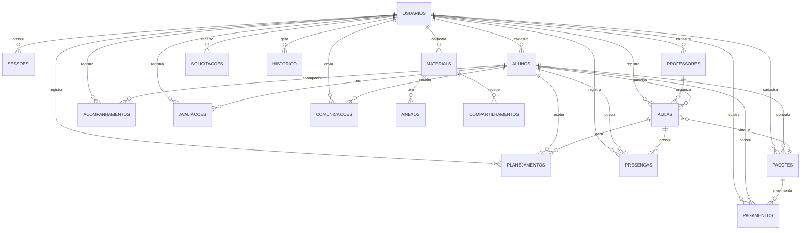

# EduConnect

Sistema de gestão para aulas particulares e reforço escolar, desenvolvido com
Node.js, TypeScript, React, Vite e SQLite.

O projeto centraliza alunos, agenda, planejamento, acompanhamento, pagamentos e
relatórios em um único ambiente.

## Índice

- [Funcionalidades](#funcionalidades)
- [Como rodar](#como-rodar)
- [Estrutura do projeto](#estrutura-do-projeto)
- [Fluxo do sistema](#fluxo-do-sistema)
- [Rotas principais](#rotas-principais)
- [Banco de dados](#banco-de-dados)
- [Diagrama Entidade Relacionamento](#diagrama-entidade-relacionamento)
- [Privacidade](#privacidade)

## Funcionalidades

- cadastro e gestão de alunos
- cadastro de professores e disciplinas
- agenda e agendamento de aulas
- aulas recorrentes e reagendamento
- planejamento de aulas e modelos reutilizáveis
- acompanhamento pedagógico, avaliações e presença
- materiais compartilhados com anexos
- gestão de pacotes, pagamentos e financeiros
- dashboard com resumo do dia e pendências
- relatórios e exportação em PDF
- histórico e auditoria de ações
- backup local do banco
- autenticação com perfis e sessões
- área do professor e área do aluno/responsável

## Como rodar

Instale as dependências:

```bash
npm ci
```

Inicie o backend:

```bash
npm run servidor
```

Em outro terminal, inicie o frontend:

```bash
npm run dev
```

Acesse:

```text
http://127.0.0.1:5173
```

O backend fica em:

```text
http://127.0.0.1:3001
```

No primeiro acesso, o sistema cria o administrador inicial.

Para verificar os tipos e compilar o frontend:

```bash
npm run build
```

## Estrutura do projeto

```text
educonnect/
├── public/
│   ├── api.ts
│   ├── App.tsx
│   ├── Agendamento.tsx
│   ├── Alunos.tsx
│   ├── Acompanhamento.tsx
│   ├── AreaProfessor.tsx
│   ├── Avaliacoes.tsx
│   ├── Cadastro.tsx
│   ├── Comunicacao.tsx
│   ├── Configuracoes.tsx
│   ├── Dashboard.tsx
│   ├── Disciplinas.tsx
│   ├── Historico.tsx
│   ├── index.html
│   ├── main.tsx
│   ├── Materiais.tsx
│   ├── Pagamentos.tsx
│   ├── Planejamento.tsx
│   ├── Presenca.tsx
│   ├── Professores.tsx
│   ├── Relatorios.tsx
│   ├── Seguranca.tsx
│   └── styles.css
├── src/
│   ├── modulos/
│   │   ├── Acompanhamento.ts
│   │   ├── Agendamento.ts
│   │   ├── Alunos.ts
│   │   ├── AreaProfessor.ts
│   │   ├── Avaliacoes.ts
│   │   ├── Comunicacao.ts
│   │   ├── Configuracoes.ts
│   │   ├── Dashboard.ts
│   │   ├── Disciplinas.ts
│   │   ├── Historico.ts
│   │   ├── Materiais.ts
│   │   ├── Pagamentos.ts
│   │   ├── Planejamento.ts
│   │   ├── Presenca.ts
│   │   ├── Professores.ts
│   │   ├── Relatorios.ts
│   │   └── Seguranca.ts
│   ├── banco.ts
│   ├── integracao.ts
│   └── servidor.ts
├── .gitignore
├── package-lock.json
├── package.json
├── README.md
├── tsconfig.json
└── vite.config.ts
```

O backend principal fica em `src/servidor.ts`, e a lógica dos módulos está em `src/modulos/`.

## Fluxo do sistema

Ao entrar no sistema, o usuário acessa a tela de autenticação. Se ainda não
houver administrador, o sistema cria o primeiro acesso e gera um código de
recuperação.

O fluxo principal é:

1. cadastrar aluno e professor responsável
2. registrar agenda e horários
3. criar planejamento, materiais e acompanhamento
4. registrar presença, avaliações e pagamentos
5. consultar dashboard, relatórios e histórico

## Rotas principais

### Autenticação

| Método | Rota | Descrição |
| --- | --- | --- |
| `GET` | `/api/auth/estado` | verifica se o sistema já foi inicializado |
| `POST` | `/api/auth/inicial` | cria o usuário administrador inicial |
| `POST` | `/api/auth/entrar` | autentica o usuário |
| `POST` | `/api/auth/recuperar` | recupera a senha |
| `GET` | `/api/auth/eu` | retorna o usuário autenticado |
| `POST` | `/api/auth/sair` | encerra a sessão |

### Gestão e módulos

| Método | Rota | Descrição |
| --- | --- | --- |
| `GET` | `/api/registros/alunos` | lista alunos |
| `POST` | `/api/registros/alunos` | cadastra aluno |
| `PUT` | `/api/registros/alunos/:id` | edita aluno |
| `GET` | `/api/registros/aulas` | lista aulas |
| `POST` | `/api/registros/aulas` | cadastra aula |
| `PUT` | `/api/registros/aulas/:id` | edita aula |
| `POST` | `/api/aulas/:id/reagendar` | reagenda aula |
| `POST` | `/api/aulas/:id/repetir` | repete aula |
| `GET` | `/api/dashboard` | retorna dados do dashboard |
| `GET` | `/api/referencias` | retorna referências para formulários |

### Acompanhamento, materiais e relatórios

| Método | Rota | Descrição |
| --- | --- | --- |
| `GET` | `/api/registros/planejamentos` | lista planos |
| `GET` | `/api/registros/acompanhamentos` | lista acompanhamentos |
| `GET` | `/api/registros/avaliacoes` | lista avaliações |
| `GET` | `/api/registros/presencas` | lista presenças |
| `POST` | `/api/materiais/:id/compartilhar` | compartilha material |
| `GET` | `/api/compartilhados/:id` | acessa material compartilhado |
| `GET` | `/api/relatorios` | gera relatório |
| `GET` | `/api/relatorios/pdf` | exporta relatório em PDF |

### Financeiro e sistema

| Método | Rota | Descrição |
| --- | --- | --- |
| `GET` | `/api/registros/pacotes` | lista pacotes |
| `GET` | `/api/registros/pagamentos` | lista pagamentos |
| `GET` | `/api/saldos` | retorna saldos dos pacotes |
| `GET` | `/api/configuracoes` | traz ajustes do sistema |
| `PUT` | `/api/configuracoes` | salva ajustes do sistema |
| `GET` | `/api/backups` | lista backups |
| `POST` | `/api/backups` | cria backup |
| `GET` | `/api/historico` | consulta histórico e auditoria |

## Banco de dados

O projeto usa SQLite como banco local.

Principais entidades:

- `usuarios` e `sessoes`
- `professores`, `alunos` e `aulas`
- `planejamentos`, `acompanhamentos`, `avaliacoes` e `presencas`
- `disciplinas`, `materiais`, `anexos` e `compartilhamentos`
- `pacotes`, `pagamentos`, `solicitacoes`, `historico` e `ajustes`

## Diagrama Entidade Relacionamento

### Visão textual

```text
USUARIOS
  ├── 1:N  SESSOES
  ├── 1:N  PROFESSORES
  ├── 1:N  ALUNOS
  ├── 1:N  AULAS
  ├── 1:N  PLANEJAMENTOS
  ├── 1:N  ACOMPANHAMENTOS
  ├── 1:N  AVALIACOES
  ├── 1:N  PRESENCAS
  ├── 1:N  MATERIALS
  ├── 1:N  PACOTES
  ├── 1:N  PAGAMENTOS
  ├── 1:N  COMUNICACOES
  ├── 1:N  SOLICITACOES
  └── 1:N  HISTORICO

PROFESSORES
  └── 1:N  AULAS

ALUNOS
  ├── 1:N  AULAS
  ├── 1:N  PLANEJAMENTOS
  ├── 1:N  ACOMPANHAMENTOS
  ├── 1:N  AVALIACOES
  ├── 1:N  PRESENCAS
  ├── 1:N  MATERIALS (via compartilhamentos)
  ├── 1:N  PACOTES
  ├── 1:N  PAGAMENTOS
  └── 1:N  COMUNICACOES

AULAS
  ├── 1:N  PLANEJAMENTOS
  ├── 1:N  PRESENCAS
  └── N:1  PACOTES

MATERIAIS
  ├── 1:N  ANEXOS
  └── 1:N  COMPARTILHAMENTOS

PACOTES
  └── 1:N  PAGAMENTOS
```

### Diagrama em Mermaid



## Privacidade

O sistema foi pensado para uso local e institucional, com controle de acesso por
perfil e permissões.

Principais pontos:

- dados sensíveis ficam em SQLite local
- sessões e permissões controlam o acesso
- solicitações de privacidade ficam registradas
- backups locais ajudam na recuperação
- o projeto não depende de serviços externos para a lógica principal

Os arquivos ignorados pelo Git, como `dados/`, `node_modules/` e `dist/`, não
devem ser enviados ao repositório.
